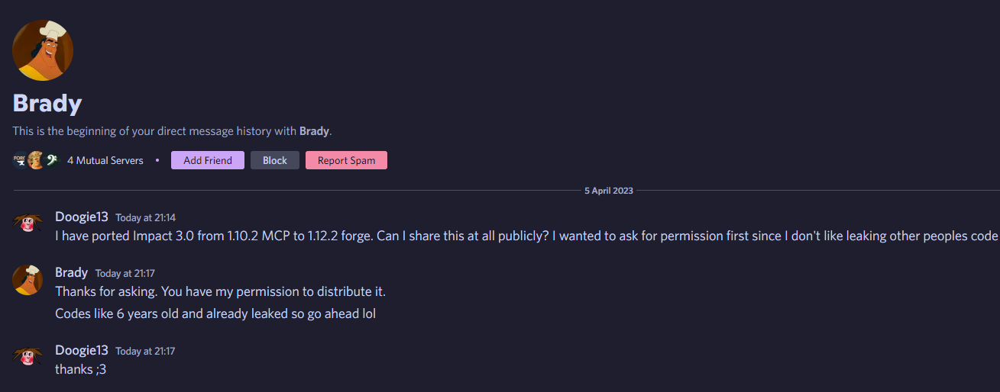

# Impact 3.0 - 1.12.2 Forge

I thought this would be fun to make

Some modules are not 100% functional, whether by their original design or because I ported them incorrectly. For example, Animations doesn't quite render properly and InventoryMove doesn't work at all.

The mixins are all an attempt to be as accurate to the original MCP code as possible. It is not meant to be pretty to look at.

### The leak that lead to this project can be downloaded [here](readme/Impact-master-85d6b607883df00e28a161c38bb847fde263bb46.7z).
### Yes, I got permission for this. I do not like to leak other people's code.

~Doogie13
